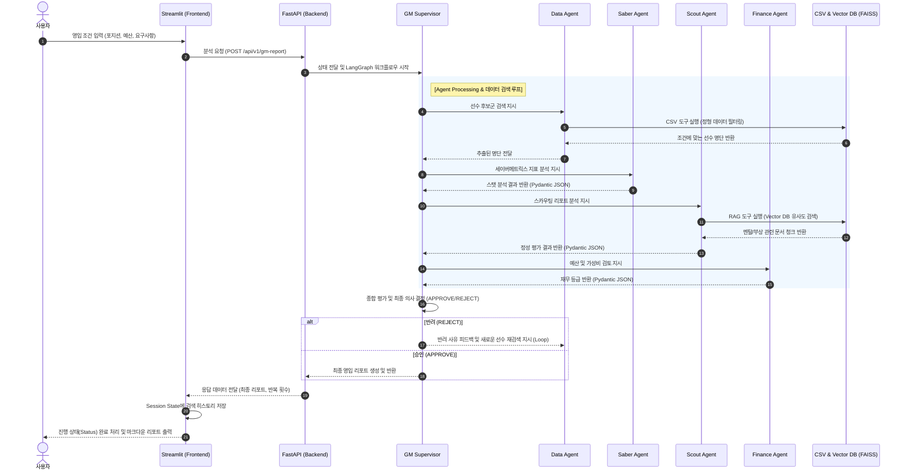

```mermaid
sequenceDiagram
    autonumber
    actor User as 사용자
    participant UI as Streamlit (Frontend)
    participant API as FastAPI (Backend)
    participant GM as GM Supervisor
    participant Data as Data Agent
    participant Saber as Saber Agent
    participant Scout as Scout Agent
    participant Finance as Finance Agent
    participant DB as CSV & Vector DB (FAISS)

    User->>UI: 영입 조건 입력 (포지션, 예산, 요구사항)
    UI->>API: 분석 요청 (POST /api/v1/gm-report)
    API->>GM: 상태 전달 및 LangGraph 워크플로우 시작

    rect rgb(240, 248, 255)
        Note right of GM: [Agent Processing & 데이터 검색 루프]
        
        GM->>Data: 선수 후보군 검색 지시
        Data->>DB: CSV 도구 실행 (정형 데이터 필터링)
        DB-->>Data: 조건에 맞는 선수 명단 반환
        Data-->>GM: 추출된 명단 전달

        GM->>Saber: 세이버메트릭스 지표 분석 지시
        Saber-->>GM: 스탯 분석 결과 반환 (Pydantic JSON)

        GM->>Scout: 스카우팅 리포트 분석 지시
        Scout->>DB: RAG 도구 실행 (Vector DB 유사도 검색)
        DB-->>Scout: 멘탈/부상 관련 문서 청크 반환
        Scout-->>GM: 정성 평가 결과 반환 (Pydantic JSON)

        GM->>Finance: 예산 및 가성비 검토 지시
        Finance-->>GM: 재무 등급 반환 (Pydantic JSON)
    end

    GM->>GM: 종합 평가 및 최종 의사 결정 (APPROVE/REJECT)

    alt 반려 (REJECT)
        GM-->>Data: 반려 사유 피드백 및 새로운 선수 재검색 지시 (Loop)
    else 승인 (APPROVE)
        GM-->>API: 최종 영입 리포트 생성 및 반환
    end

    API-->>UI: 응답 데이터 전달 (최종 리포트, 반복 횟수)
    UI->>UI: Session State에 검색 히스토리 저장
    UI-->>User: 진행 상태(Status) 완료 처리 및 마크다운 리포트 출력
```
