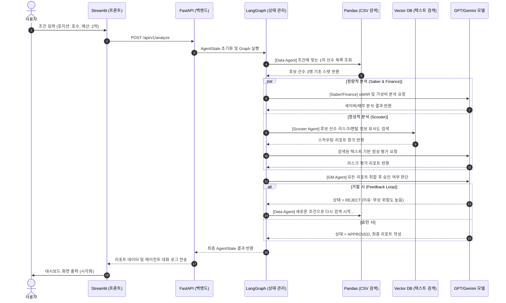

```mermaid
sequenceDiagram
    autonumber
    actor User as 사용자
    participant UI as Streamlit (프론트)
    participant API as FastAPI (백엔드)
    participant Graph as LangGraph (상태 관리)
    participant Tool as Pandas (CSV 검색)
    participant RAG as Vector DB (텍스트 검색)
    participant LLM as GPT/Gemini 모델

    User->>UI: 조건 입력 (포지션: 포수, 예산: 2억)
    UI->>API: POST /api/v1/analyze
    API->>Graph: AgentState 초기화 및 Graph 실행
    
    %% 데이터 수집 단계
    Graph->>Tool: [Data Agent] 조건에 맞는 1차 선수 목록 조회
    Tool-->>Graph: 후보 선수 3명 기초 스탯 반환
    
    %% 병렬 분석 단계 (RAG 및 스탯 분석)
    par 정량적 분석 (Saber & Finance)
        Graph->>LLM: [Saber/Finance] sWAR 및 가성비 분석 요청
        LLM-->>Graph: 세이버/재무 분석 결과 반환
    and 정성적 분석 (Scouter)
        Graph->>RAG: [Scouter Agent] 후보 선수 리스크/멘탈 정보 유사도 검색
        RAG-->>Graph: 스카우팅 리포트 청크 반환
        Graph->>LLM: 검색된 텍스트 기반 정성 평가 요청
        LLM-->>Graph: 리스크 평가 리포트 반환
    end
    
    %% GM 의사결정
    Graph->>LLM: [GM Agent] 모든 리포트 취합 후 승인 여부 판단
    
    alt 거절 시 (Feedback Loop)
        LLM-->>Graph: 상태 = REJECT (이유: 부상 위험도 높음)
        Graph->>Tool: [Data Agent] 새로운 조건으로 다시 검색 시작...
    else 승인 시
        LLM-->>Graph: 상태 = APPROVED, 최종 리포트 작성
    end
    
    Graph-->>API: 최종 AgentState 결과 반환
    API-->>UI: 리포트 데이터 및 에이전트 대화 로그 전송
    UI->>User: 대시보드 화면 출력 (시각화)
```
